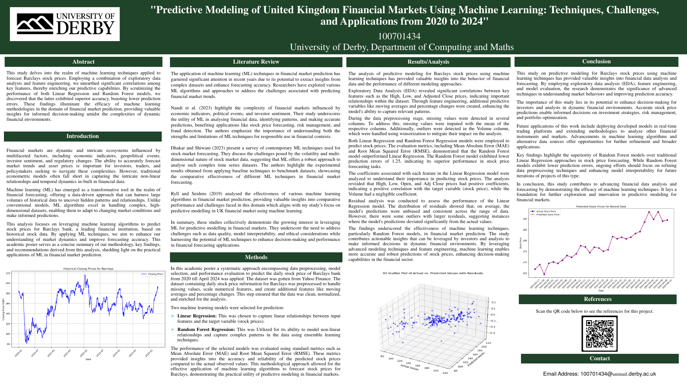
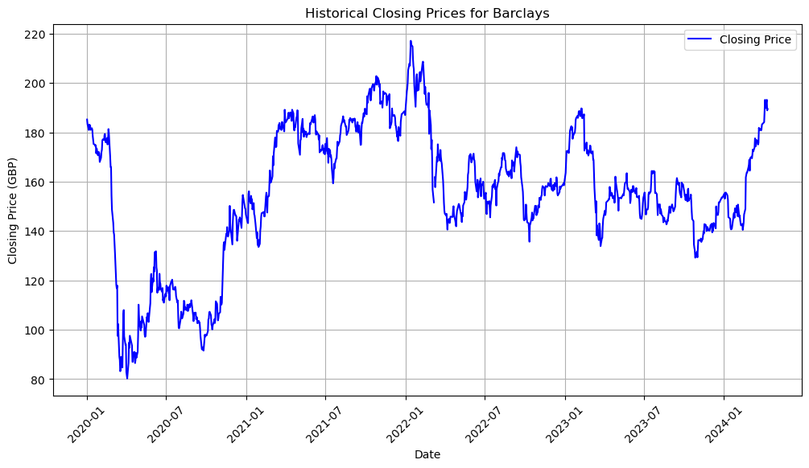

# 📈 Predicting Barclays Stock Prices with Machine Learning

Academic poster project that predicts the daily share price of **Barclays (LSE: BARC)** from January 2020 to April 2024, comparing **Linear Regression** with **Random Forest Regression**.

**Tools:** Python · pandas · scikit-learn · Matplotlib · Yahoo Finance data

📄 [Full-resolution poster (PDF)](poster/barclays_stock_prediction_poster.pdf)

---

## Approach

1. **Data:** daily Open, High, Low, Close, Adjusted Close and Volume for Barclays from Yahoo Finance, Jan 2020 – Apr 2024. The period covers the COVID crash, when the price fell from about 180p to about 80p, and the recovery.
2. **Preprocessing:** mean imputation for missing values, **winsorisation** of outliers in trading volume, and feature scaling.
3. **Feature engineering:** moving averages and daily percentage changes.
4. **Models:** Linear Regression as an interpretable baseline, and Random Forest Regression for non-linear patterns.
5. **Evaluation:** MAE and RMSE, plus residual analysis.

## Results

- **Random Forest beat Linear Regression on both MAE and RMSE**, with a prediction error of **1.25**.
- Linear Regression coefficients showed High, Low, Open and Adjusted Close as strong positive drivers, with **Volume contributing almost nothing**.
- Residuals were centred on zero (unbiased), with a few larger errors during volatile periods.

## What I'd do differently

This was an early project, and looking back the near-perfect fit has a clear cause. The model used **same-day** High, Low, Open and Adjusted Close prices to predict that day's Close, and those values are only known once the day is over. A version that would actually help an investor should:

- predict **tomorrow's** close (or return) using only **lagged** features available today,
- use a strictly **time-ordered** train/test split,
- compare against a **naive baseline** ("tomorrow = today"), which is surprisingly hard to beat for stock prices,
- add context such as FTSE 100 movements, interest-rate decisions and earnings dates.

---

*Poster produced for the Studying at Masters Level module of my MSc Big Data Analytics, University of Derby, 2024.*
